# Lab 01 : Creating the Migration Bundle 

>Please execute lab 0 to install the pre requisites and download the project files.

## Step 1 : Create a workspace in AMA.

1. Go to the AMA UI url which was shown in last lab.
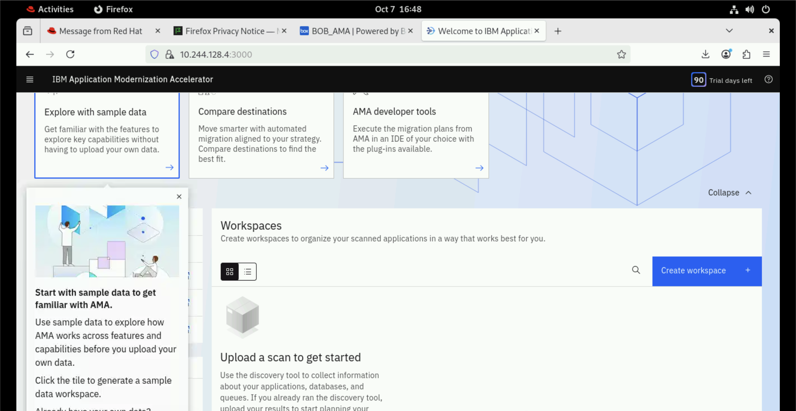
2. Click on Create workspace and give it any name and click on Create.
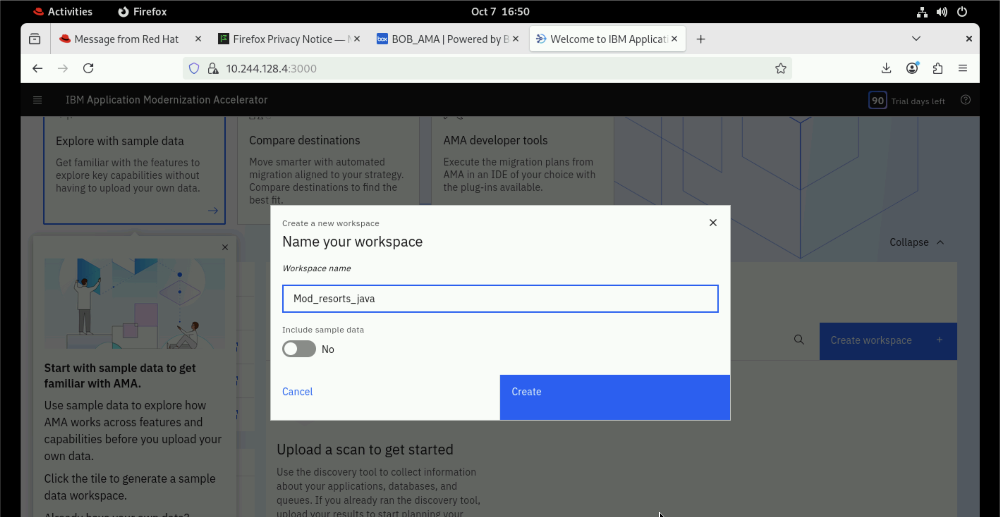
3. Click on Open discovery tool.
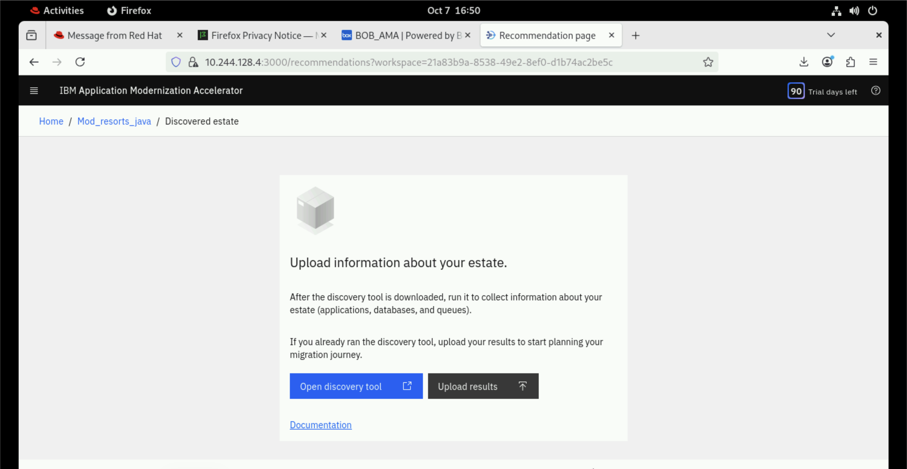
4. Select Linux in the dropdown and click Download discovery tool.
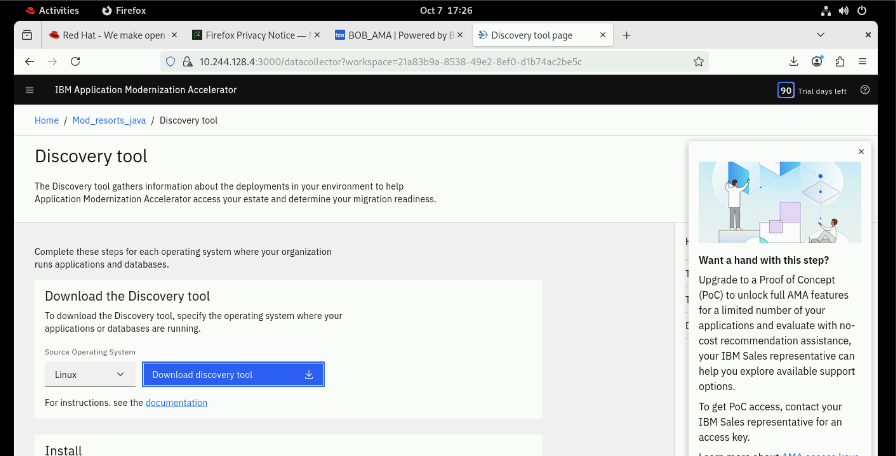
5. Wait till the tool is downloaded.
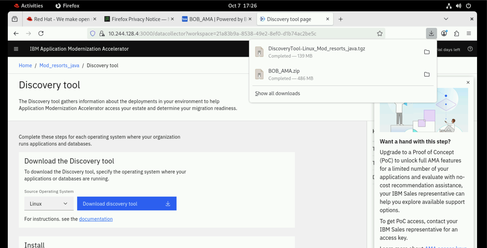
## Step 2 : Run the Discovery Tool

1. Open Terminal by clicking on Activities in top left corner and selecting Terminal from the taskbar. Run the follwing commands.
```bash
cd Downloads
```
```bash
tar xvfz DiscoveryTool-Linux_Mod_resorts_java.tgz
```
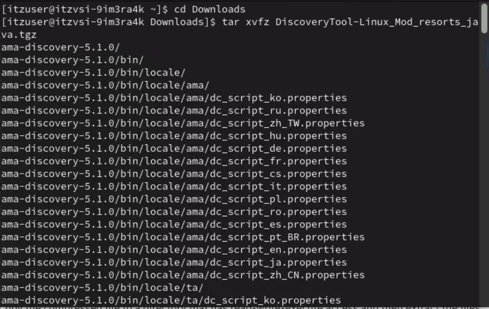

2. Once the Tool files are extracted. Run the following commands. We are using the project .war file when we downloaded all the project files in Lab 0.
```bash
cd ama-discovery-5.1.0
```
```bash
./bin/ama-discovery --tomcat-apps-location ~/Downloads/BOB_AMA/ibm-ama-bob-liberty-replatforming/java-liberty-replatforming/target/modresorts-2.0.0.war
```

3. Accept the License Agreements.
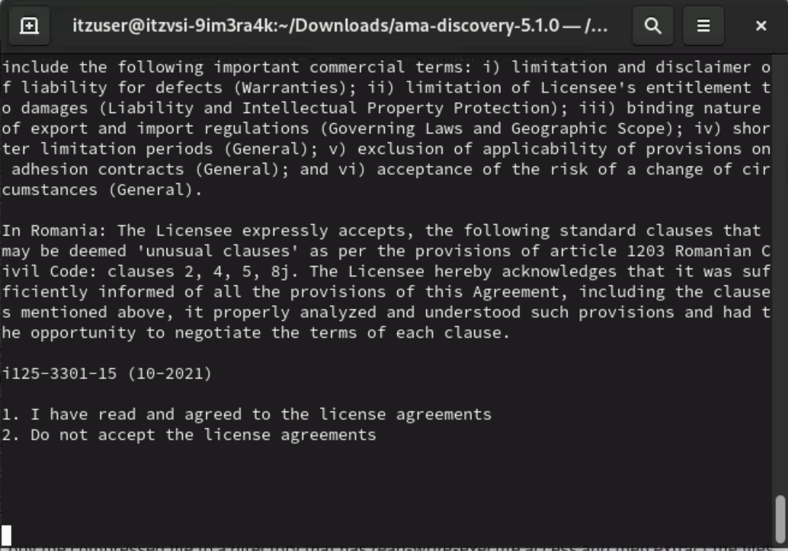
4. Select the java verison as option 4 i.e 1.8.
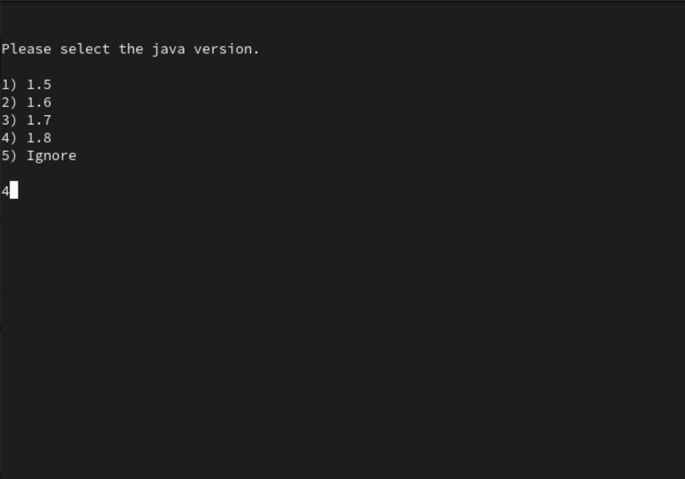
5. Wait till the Tool finished running the analysis and auto uploads the data to AMA.
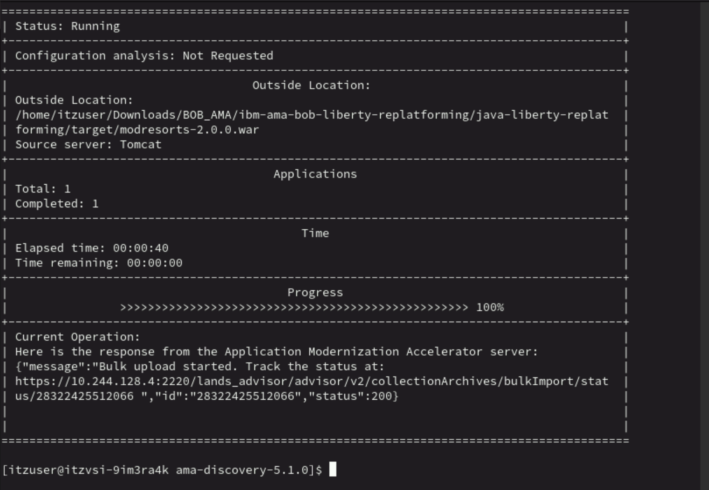
## Step 3 : View Migration Bundle
1. Head back to AMA UI and open the workspace that we created earlier.
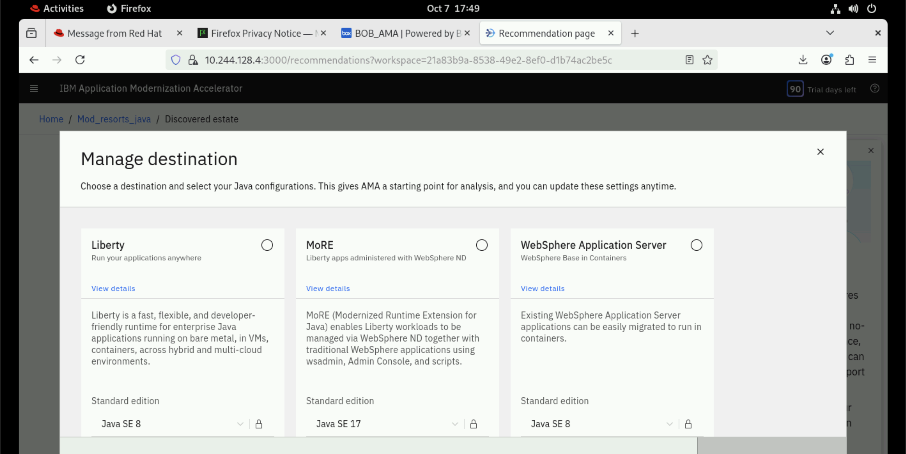
2. Select Liberty and click on Confirm.
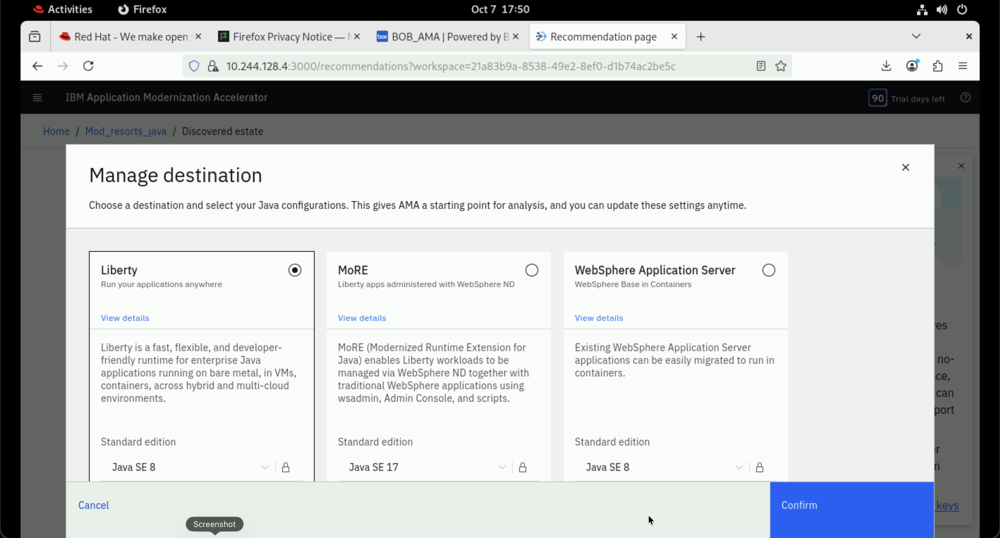
3. You should see something like shown in the image.
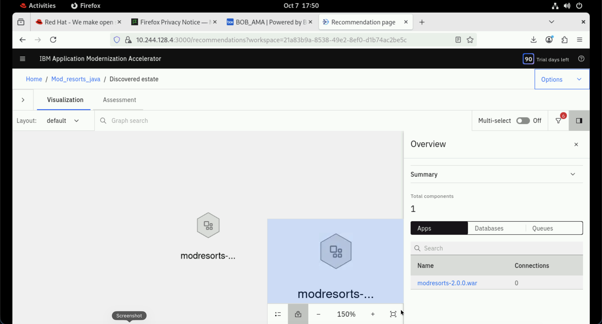
4. Click on the Assesment Tab and scroll down. You will see you application details. Click on the (->) arrow to view plan.
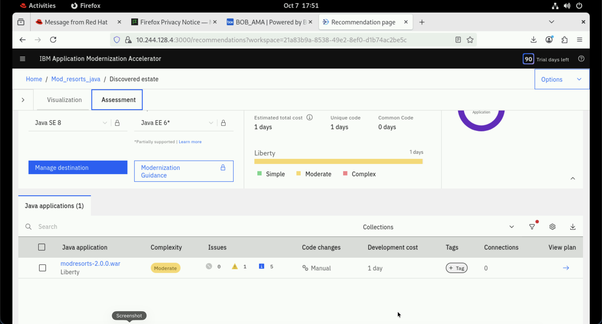
5. Since we are using a trial version, you can only see the migration overview here. To download the migration bundle we need a full verison.
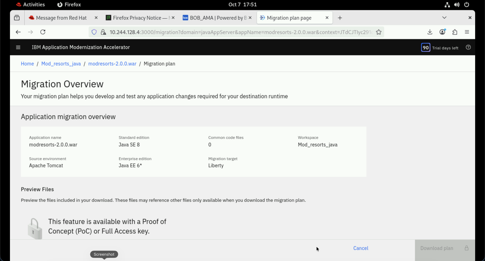

